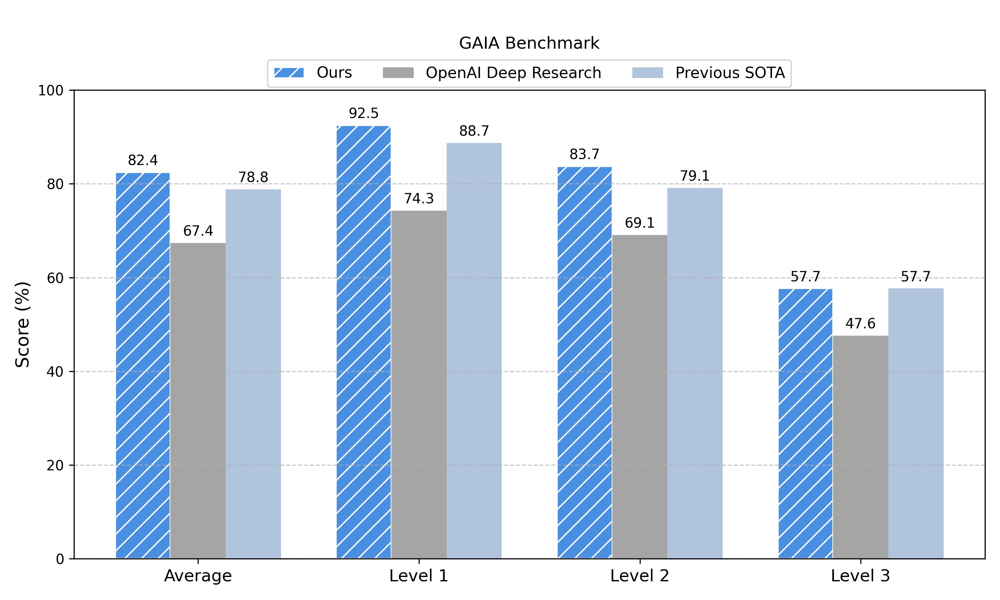

# DeepResearchAgent

## Introduction

DeepResearchAgent is a hierarchical multi-agent system designed not only for deep research tasks but also for general-purpose task solving. The framework leverages a top-level planning agent to coordinate multiple specialized lower-level agents, enabling automated task decomposition and efficient execution across diverse and complex domains.

## Architecture

The system adopts a two-layer structure:

### 1. Top-Level Planning Agent
- Responsible for understanding, decomposing, and planning the overall workflow for a given task.
- Breaks down tasks into manageable sub-tasks and assigns them to appropriate lower-level agents.
- Dynamically coordinates the collaboration among agents to ensure smooth task completion.

### 2. Specialized Lower-Level Agents
- **Deep Analyzer**
  - Performs in-depth analysis of input information, extracting key insights and potential requirements.
  - Supports analysis of various data types, including text and structured data.
- **Deep Researcher**
  - Conducts thorough research on specified topics or questions, retrieving and synthesizing high-quality information.
  - Capable of generating research reports or knowledge summaries automatically.
- **Browser Use**
  - Automates browser operations, supporting web search, information extraction, and data collection tasks.
  - Assists the Deep Researcher in acquiring up-to-date information from the internet.

## Features
- Hierarchical agent collaboration for complex and dynamic task scenarios
- Extensible agent system, allowing easy integration of additional specialized agents
- Automated information analysis, research, and web interaction capabilities
  

## Updates
- 2025.05.27
  - Updated the available remote API calls to support OpenAI, Anthropic, and Google LLMs.
  - Added support for local Qwen models (via vllm, compatible with OpenAI API format, see details at the end of README)

## TODO List
- [x] Asynchronous feature completed
- [ ] Image Generation Agent to be developed
- [ ] MCP in progress
- [ ] AI4Research Agent to be developed
- [ ] Novel Writing Agent to be developed

## Installation

### Prepare Environment
```
# poetry install environment
conda create -n dra python=3.11
conda activate dra
make install

# (Optional) You can also use requirements.txt to setup the environment
conda create -n dra python=3.11
conda activate dra
make install-requirements

# If you encounter any issues with Playwright during installation, you can install it manually:
pip install playwright
playwright install chromium --with-deps --no-shell
```

### Put `.env` in the root

`.env` should be like
```
PYTHONWARNINGS=ignore # ignore warnings
ANONYMIZED_TELEMETRY=false # disable telemetry
HUGGINEFACE_API_KEY=abcabcabc # your huggingface api key
OPENAI_API_BASE=https://api.openai.com/v1
OPENAI_API_KEY=abcabcabc # your openai api key
ANTHROPIC_API_BASE=https://api.anthropic.com
ANTHROPIC_API_KEY=abcabcabc # your anthropic api key
GOOGLE_APPLICATION_CREDENTIALS=/your/user/path/.config/gcloud/application_default_credentials.json
GOOGLE_API_BASE=https://generativelanguage.googleapis.com
GOOGLE_API_KEY=abcabcabc # your google api key
```

```
Note: Maybe you have some problems using google api, here is the reference
1. Get api key from https://aistudio.google.com/app/apikey

2. Get `application_default_credentials.json`. Here is the reference: https://cloud.google.com/docs/authentication/application-default-credentials?hl=zh-cn
# Creating a Google API key requires it to be linked to a project, but the project may also need Vertex AI authorization, so it is necessary to obtain the appropriate credentials.
brew install --cask google-cloud-sdk
gcloud init
gcloud auth application-default login
```

## Usage

### Deep Researcher for "AI Agent" as an example
```
python examples/run_example.py
```

### GAIA as an example

```
# Download GAIA
mkdir data | cd data
git clone https://huggingface.co/datasets/gaia-benchmark/GAIA

# Run the script in the examples
python examples/run_gaia.py
```

## Experiments
We evaluated our agent on the GAIA validation set and achieved state-of-the-art performance on May 10th.
<p align="center">
  
</p>

## Acknowledgement
DeepResearchAgent is primarily inspired by the architecture of smolagents. The following improvements have been made:
- The codebase of smolagents has been modularized for better structure and organization.
- The original synchronous framework has been refactored into an asynchronous one.
- The multi-agent setup process has been optimized to make it more user-friendly and efficient.

We would like to express our gratitude to the following open source projects, which have greatly contributed to the development of this work:
- [smolagents](https://github.com/huggingface/smolagents) - A lightweight agent framework.
- [OpenManus](https://github.com/mannaandpoem/OpenManus) - An asynchronous agent framework.
- [browser-use](https://github.com/browser-use/browser-use) - An AI-powered browser automation tool.
- [crawl4ai](https://github.com/unclecode/crawl4ai) - A web crawling library for AI applications.
- [markitdown](https://github.com/microsoft/markitdown) - A tool for converting files to Markdown format.

We sincerely appreciate the efforts of all contributors and maintainers of these projects for their commitment to advancing AI technologies and making them available to the wider community.

## Contribution

Contributions and suggestions are welcome! Feel free to open issues or submit pull requests to improve the project.

## Cite
```
@misc{DeepResearchAgent,
  title =        {`DeepResearchAgent`: A Hierarchical Multi-Agent Framework for General-purpose Task Solving.},
  author =       {Wentao Zhang, Ce Cui, Yang Liu, Bo An},
  howpublished = {\url{https://github.com/SkyworkAI/DeepResearchAgent}},
  year =         {2025}
}
```

## Questions

### 1. About Qwen models
Our project is based on the vllm startup qwen model, so that you can call the local model just by providing api_base, just like the model of openai. 
Details about start qwen model through vllm: https://docs.vllm.ai/en/latest/getting_started/quickstart.html#openai-completions-api-with-vllm
```

# start your service
pip install vllm
vllm serve Qwen/Qwen2.5-1.5B-Instruct

# put api_base to .env
QWEN_API_BASE=http://localhost:8000/v1
QWEN_API_KEY="no need, abcabcabc will be ok"

# Configure your config file to use qwen's model
model_id = "qwen"
```

### 2. About browser use
If you are having problems with your browser, please reinstall the browser tool.
```
pip install "browser-use[memory]"==0.1.47

# install playwright
pip install playwright
playwright install chromium --with-deps --no-shell
```

### 3. About calling for sub agents
I’ve found that both OpenAI and Google models are strictly trained for function calling, which means they no longer use JSON outputs to invoke sub-agents. Therefore, I recommend using Claude-3.7-Sonnet as the planning agent whenever possible. That said, I will fix this issue soon by providing the sub-agents to the planning agent via function calling.