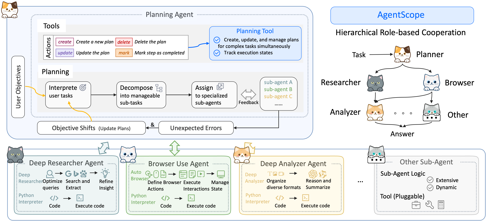

# DeepResearchAgent

English | [简体中文](README_CN.md)

## Introduction

DeepResearchAgent is a hierarchical multi-agent system designed not only for deep research tasks but also for general-purpose task solving. The framework leverages a top-level planning agent to coordinate multiple specialized lower-level agents, enabling automated task decomposition and efficient execution across diverse and complex domains.

## Architecture

<p align="center">

  

</p>

The system adopts a two-layer structure:

### 1. Top-Level Planning Agent

* Responsible for understanding, decomposing, and planning the overall workflow for a given task.
* Breaks down tasks into manageable sub-tasks and assigns them to appropriate lower-level agents.
* Dynamically coordinates the collaboration among agents to ensure smooth task completion.

### 2. Specialized Lower-Level Agents

* **Deep Analyzer**

  * Performs in-depth analysis of input information, extracting key insights and potential requirements.
  * Supports analysis of various data types, including text and structured data.
* **Deep Researcher**

  * Conducts thorough research on specified topics or questions, retrieving and synthesizing high-quality information.
  * Capable of generating research reports or knowledge summaries automatically.
* **Browser Use**

  * Automates browser operations, supporting web search, information extraction, and data collection tasks.
  * Assists the Deep Researcher in acquiring up-to-date information from the internet.

## Features

- Hierarchical agent collaboration for complex and dynamic task scenarios
- Extensible agent system, allowing easy integration of additional specialized agents
- Automated information analysis, research, and web interaction capabilities
- Secure Python code execution environment for tools, featuring configurable import controls, restricted built-ins, attribute access limitations, and resource limits. (See [PythonInterpreterTool Sandboxing](./docs/python_interpreter_sandbox.md) for details).
  

## Updates
* **2025.06.20**: Add the support for the mcp (Both the local mcp and remote mcp).
* **2025.06.17**: Update technical report https://arxiv.org/pdf/2506.12508.
* **2025.06.01**: Update the browser-use to 0.1.48.
* **2025.05.30**: Convert the sub agent to a function call. Planning agent can now be gpt-4.1 or gemini-2.5-pro.
* **2025.05.27**: Support OpenAI, Anthropic, Google LLMs, and local Qwen models (via vLLM, see details in [Usage](#usage)).

## TODO List

* [x] Asynchronous feature completed
* [ ] Image Generation Agent to be developed
* [x] MCP in progress
* [ ] AI4Research Agent to be developed
* [ ] Novel Writing Agent to be developed

## Installation

### Prepare Environment

```bash
# poetry install environment
conda create -n dra python=3.11
conda activate dra
make install

# (Optional) You can also use requirements.txt
conda create -n dra python=3.11
conda activate dra
make install-requirements

# playwright install if needed
pip install playwright
playwright install chromium --with-deps --no-shell
```

### Set Up `.env`

```bash
PYTHONWARNINGS=ignore
ANONYMIZED_TELEMETRY=false
HUGGINEFACE_API_KEY=abcabcabc
OPENAI_API_BASE=https://api.openai.com/v1
OPENAI_API_KEY=abcabcabc
ANTHROPIC_API_BASE=https://api.anthropic.com
ANTHROPIC_API_KEY=abcabcabc
GOOGLE_APPLICATION_CREDENTIALS=/your/user/path/.config/gcloud/application_default_credentials.json
GOOGLE_API_BASE=https://generativelanguage.googleapis.com
GOOGLE_API_KEY=abcabcabc
```

Refer to:

* [https://aistudio.google.com/app/apikey](https://aistudio.google.com/app/apikey)
* [https://cloud.google.com/docs/authentication/application-default-credentials?hl=zh-cn](https://cloud.google.com/docs/authentication/application-default-credentials?hl=zh-cn)

```bash
brew install --cask google-cloud-sdk
gcloud init
gcloud auth application-default login
```

## Usage

### Deep Researcher for "AI Agent"

```bash
python examples/run_example.py
```

### GAIA Evaluation Example

```bash
# Download GAIA
mkdir data && cd data
git clone https://huggingface.co/datasets/gaia-benchmark/GAIA

# Run
python examples/run_gaia.py
```

## Experiments

We evaluated our agent on the GAIA validation set and achieved state-of-the-art performance on May 10th.

<p align="center">
  
</p>

## Questions

### 1. About Qwen Models

Our framework now supports:

* qwen2.5-7b-instruct
* qwen2.5-14b-instruct
* qwen2.5-32b-instruct

Update your config:

```toml
model_id = "qwen2.5-7b-instruct"
```

### 2. Browser Use

If problems occur, reinstall:

```bash
pip install "browser-use[memory]"==0.1.48
pip install playwright
playwright install chromium --with-deps --no-shell
```

### 3. Sub-Agent Calling

Function-calling is now supported natively by GPT-4.1 / Gemini 2.5 Pro. Claude-3.7-Sonnet is also recommended.

### 4. Use vllm for local models
We provide huggingface as a shortcut to the local model. Also provide vllm as a way to start services so that parallel acceleration can be provided.

#### Step 1: Launch the vLLM Inference Service

```bash
nohup bash -c 'CUDA_VISIBLE_DEVICES=0,1 python -m vllm.entrypoints.openai.api_server \
  --model /input0/Qwen3-32B \
  --served-model-name Qwen \
  --host 0.0.0.0 \
  --port 8000 \
  --max-num-seqs 16 \
  --enable-auto-tool-choice \
  --tool-call-parser hermes \
  --tensor_parallel_size 2' > vllm_qwen.log 2>&1 &
```

Update `.env`:

```bash
QWEN_API_BASE=http://localhost:8000/v1
QWEN_API_KEY="abc"
```

#### Step 2: Launch the Agent Service

```bash
python main.py
```

Example command:

```bash
Use deep_researcher_agent to search the latest papers on the topic of 'AI Agent' and then summarize it.
```

## Acknowledgement

DeepResearchAgent is primarily inspired by the architecture of smolagents. The following improvements have been made:
- The codebase of smolagents has been modularized for better structure and organization.
- The original synchronous framework has been refactored into an asynchronous one.
- The multi-agent setup process has been optimized to make it more user-friendly and efficient.

We would like to express our gratitude to the following open source projects, which have greatly contributed to the development of this work:
- [smolagents](https://github.com/huggingface/smolagents) - A lightweight agent framework.
- [OpenManus](https://github.com/mannaandpoem/OpenManus) - An asynchronous agent framework.
- [browser-use](https://github.com/browser-use/browser-use) - An AI-powered browser automation tool.
- [crawl4ai](https://github.com/unclecode/crawl4ai) - A web crawling library for AI applications.
- [markitdown](https://github.com/microsoft/markitdown) - A tool for converting files to Markdown format.

We sincerely appreciate the efforts of all contributors and maintainers of these projects for their commitment to advancing AI technologies and making them available to the wider community.

## Contribution

Contributions and suggestions are welcome! Feel free to open issues or submit pull requests.

## Cite

```bibtex
@misc{zhang2025agentorchestrahierarchicalmultiagentframework,
      title={AgentOrchestra: A Hierarchical Multi-Agent Framework for General-Purpose Task Solving}, 
      author={Wentao Zhang, Ce Cui, Yilei Zhao, Rui Hu, Yang Liu, Yahui Zhou, Bo An},
      year={2025},
      eprint={2506.12508},
      archivePrefix={arXiv},
      primaryClass={cs.AI},
      url={https://arxiv.org/abs/2506.12508}, 
}
```

---

### 🇨🇳 中文版说明文档

如果你更习惯阅读中文说明文档，请查阅 [README_CN.md](./README_CN.md)。
